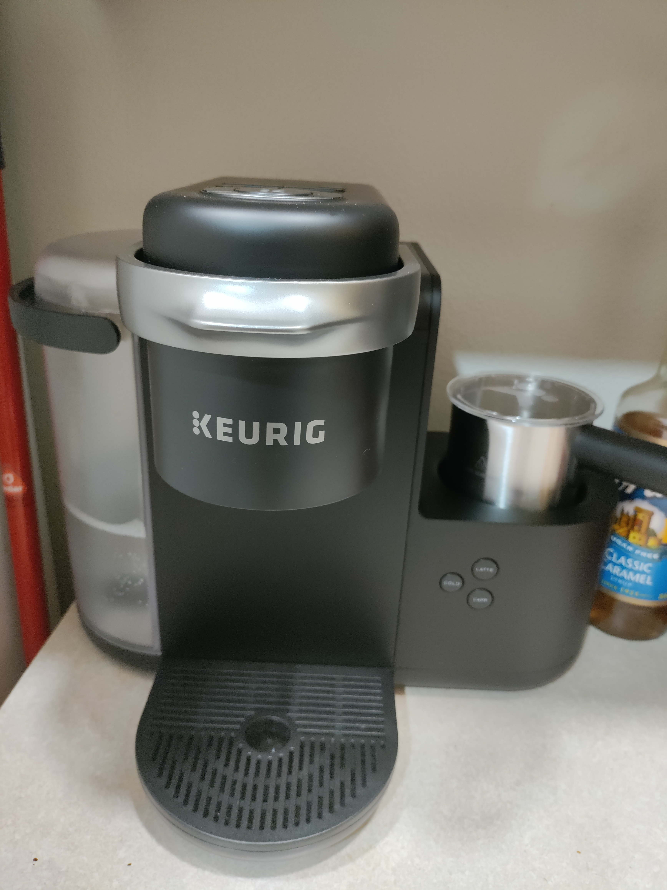
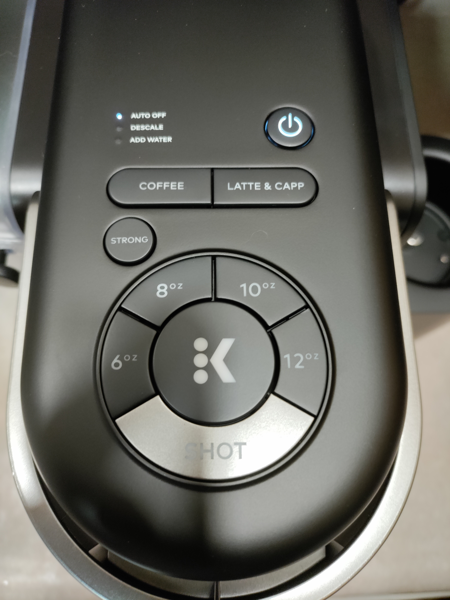

# The Keureg K-Cafe Experience

by Nicholas Shaddox December 13th, 2022

# The Unboxing

I've had a Keurig for a few years now. My wife got it for me for Christmas in 2018 and I have used it nearly every single day. Lately, I haven't been using it as much because I've been drinking chai tea lattas. Specifically using chai tea from Chico Chai (The best I have ever had). A friend of mine mentioned that he got his girlfriend a Keurig that could make lattes and I went on the hunt. After doing some research, it looks like the one he mentioned was the best one for the price. My wife bought it for me the very next day.

# Goals

* Turn off the AUTO OFF
* Make a regular coffee (with k-cup)
* Make a latte (with k-cup)

# Making A Coffee

After cleaning the machine, I powered it on. There was no noise to indicate it was on but there was a backlight on the power button. From my experience using my old Keurig, I knew that it would take some time to heat the water before it would indicate that it is ready to use. Sure enough, that is exactly what happened. 

Once it was ready then the "COFFEE", "LATTE & CAPP", and "STRONG" button were on. It wasn't until this point that I saw the AUTO-OFF indicator. I can tell what it does but turning it off was a mystery. There is no button marked for this and but my other Keurig had a button. The only thing I can think of is a long press of the power button. Sure enough, it did exactly as I thought. 

Now I want to make a regular cup of coffee like I usually do. The problem is, I don't know how much coffee my other Keurig made using the large icon (the one I commonly use). I had to test it out with my old Keurig and it looks like it is close to 10oz. Next, I filled up the water reservoir which was very straightforward. Then lifted the top, which has a little tab in the front, just like my older Keurig, put my k-cup in, and closed it. Now the icons that were on, started blinking. Again, this is how my older Keurig worked.

Since I want to make a regular coffee at 10oz, I selected the coffee button and then the coffee button lit up solid and the amounts started blinking. So, I selected the 10oz button then the center icon (that looks like a K) started blinking. Once I pressed the K, you could hear the machine start to purr. I feel like Keurig is doing a great job leading you to your next options. My older Keurig had a power button, a sleep button, and 3 size buttons. It was much simpler but don't feel this one adds any more difficulty of use, just more steps. The coffee was great!

# Making A Latte

Making a latte on a Keurig is a new experience for me but I have a feeling that I could do it without any instructions or external assistance. I do everything again to the point where I pick coffee or a latte. Selecting the latte automatically highlighted the shot button and the K button started flashing with the strong button light up as well. I thought I was going to have to pick the strong button first but it already knew what I wanted. 

Now I want to further my almond milk for the latte. There are 3 buttons on the side of the machine, COLD, LATTE, and CAPP. I assume that unless I select the cold option, it will also steam my milk for me. On the inside of the cup is a line indicating a fill line for each option. I filled it to the latte line and pressed the latte button. This did exactly as I thought and had a tasty latte in just a few minutes.

# Conclusion

The Keurig K-Cafe uses consistency throughout its design iterations (Keurig generations) so that you can easily pick up its new features without having to learn an entirely new system. I had no problems transitioning from my older Keurig to the new one. I also think the design is also very **efficient** even with the added options. Since it leads you to the next step, it reduces the amount of error that could result.

I wanted to have my son run through the machine to see how a new user of the device would respond to the indications but he insisted that he doesn't like coffee and didn't want to bother with it. Kids will be kids. Even for a new user, I don't think there should be any changes made to the design. I think it works perfectly as it is and should stay that way for future Keuregs. 
